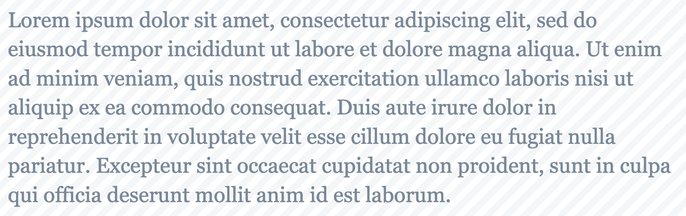

# Obsidian Image to Text

Recognize Text on images in your notes. Replace the image with the text or append it to the image.

## Commands

| Command                                            | Description                                                                                       |
| -------------------------------------------------- | ------------------------------------------------------------------------------------------------- |
| Image To Text: Replace Selection                   | Replace your image with the recognized text. Recognize text based on language defined in settings |
| Image To Text: Replace Selection - custom language | Replace your image with the recognized text. Recognize text based on custom selection             |
| Image To Text: Append Selection                    | Append the recognized text to your image. Recognize text based on language defined in settings    |
| Image To Text: Append Selection - custom language  | Append the recognized text to your image. Recognize text based on custom selection                |

### Examples

## Installation

### Community Plugin

-   Follow this link [Obsidian Plugin](https://obsidian.md/plugins?id=image-to-text-ocr)
-   Or open Obsidian Settings, go to Community Plugins, browse "Image to Text OCR" click install and activte.

### Manually installing the plugin

-   Go to the latest [Releases](https://github.com/dario-baumberger/obsidian-image-to-text-ocr/releases)
-   Download `main.js`, `manifest.json`
-   save into your vault `VaultFolder/.obsidian/plugins/obsidian-image-to-text-ocr/`

## Contribution

-   Feel free to [open an issue](https://github.com/dario-baumberger/obsidian-image-to-text-ocr/issues) if you miss something
-   Feel free to open a Pull request to implement a feature
    -   Please extend tests if you ad logic
