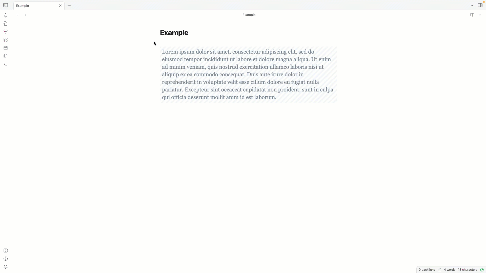

# Obsidian Image to Text

Recognize Text on images in your notes. Select the image and run the command. The recognized text will be appended to your image or will replace your image - depending on the command

## Commands

| Command                                            | Description                                                                                           |
| -------------------------------------------------- | ----------------------------------------------------------------------------------------------------- |
| Image To Text: Replace Selection                   | Replace your image with the recognized text. Recognize text based on the language defined in settings |
| Image To Text: Replace Selection - custom language | Replace your image with the recognized text. Recognize text based on custom selection                 |
| Image To Text: Append Selection                    | Append the recognized text to your image. Recognize text based on language defined in settings        |
| Image To Text: Append Selection - custom language  | Append the recognized text to your image. Recognize text based on custom selection                    |

## Example

## Supported Image Types

-   .jpg
-   .jpeg
-   .png
-   .gif
-   .bmp
-   .pbm
-   .webp

## Supported Markup

| Format                        | Example                                             | Description                        |
| ----------------------------- | --------------------------------------------------- | ---------------------------------- |
| Obsidian Image                | `![[example.png]]`                                  | Obsidian image tag                 |
| Obsidian Image including size | `![[example.png\|300]]`                             | Obsidian image tag including size  |
| Markdown Image                | ``     | Markdown image tag                 |
| URL                           | `https://www.example.com/example.png`               | URL to an image                    |
| img Tag                       | `` | Img tag with a valid src attribute |

## Installation

### Community Plugin

-   Follow this link [Obsidian Plugin](https://obsidian.md/plugins?id=image-to-text-ocr)
-   Or open Obsidian Settings, go to Community Plugins, browse "Image to Text OCR" click install and activate.

### Manually installing the plugin

-   Go to the latest [Releases](https://github.com/dario-baumberger/obsidian-image-to-text-ocr/releases)
-   Download `main.js`, `manifest.json`
-   save into your vault `VaultFolder/.obsidian/plugins/obsidian-image-to-text-ocr/`

### Settings

| Name                 | Description                                                                                                                               |
| -------------------- | ----------------------------------------------------------------------------------------------------------------------------------------- |
| Content language     | Select language to recognize. Default is Englisch. If images contain special characters, changing the language may perform better results |
| Enable debug logging | If enabled, more will be logged in the console.                                                                                           |

## Ressources

This plugin uses [tesseract.js](https://github.com/naptha/tesseract.js/) to recognize text.

## Contribution

-   Feel free to [open an issue](https://github.com/dario-baumberger/obsidian-image-to-text-ocr/issues) if you miss something
-   Feel free to open a Pull request to implement a feature
    -   Please extend tests if you add logic

todo
command icons
